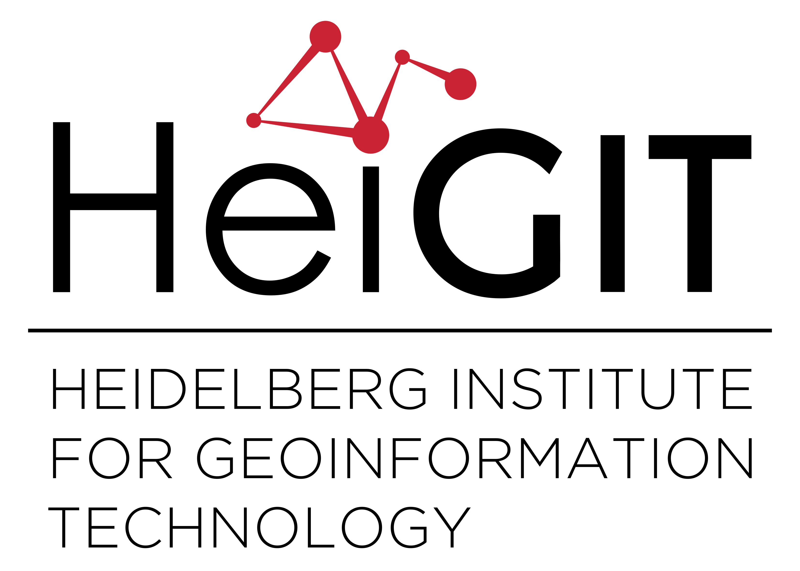
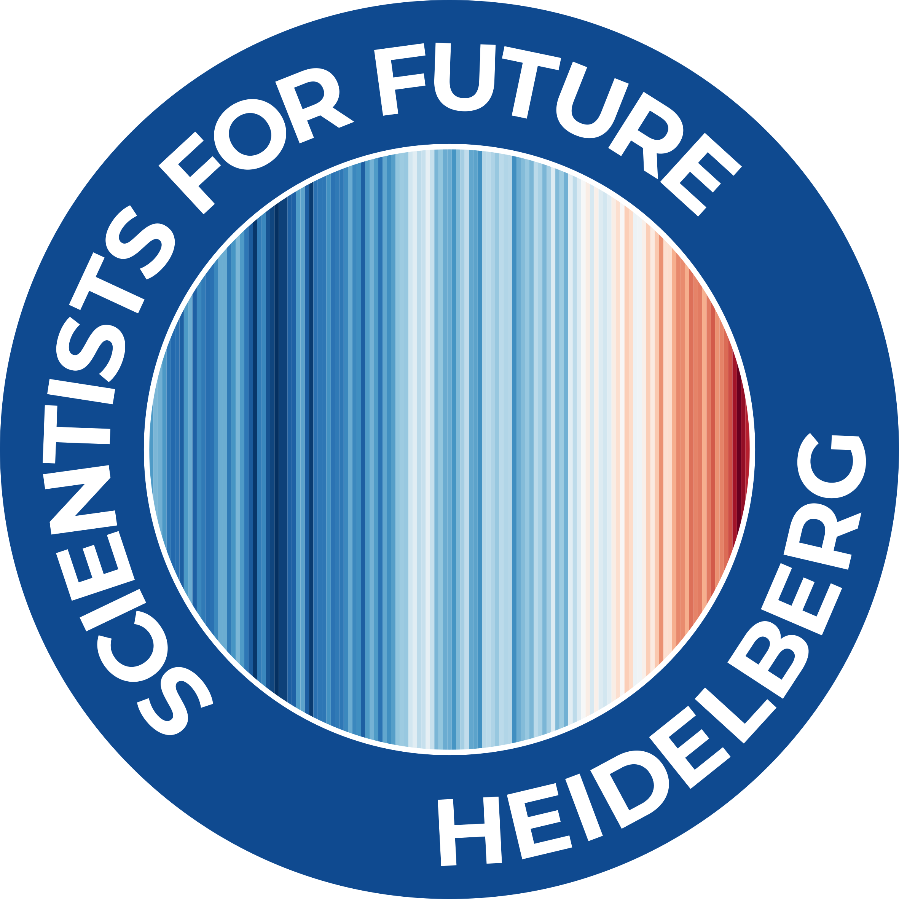

# Pledge4Future App

Pledge4Future is a project to help you and your working group to measure and reduce your work-related CO<sub>2</sub>e emissions.

The [pledge4future app](https://pledge4future.org) allows you to calculate your work related CO<sub>2</sub>e emissions from heating and electricity consumptions as well as business trips and commuting. The methodology for the calculation the emissions is implemented in the [co2calculator package](https://github.com/pledge4future/co2calculator).

Check out the [demo emission dashboard](https://pledge4future.org/dashboard)!

### Installation

This is a dockerized app which uses React in the frontend and Python, Django and GraphQL in the backend.

### 1. Clone repository 

```
git clone 
cd WePledge
```

### 2. Load the submodules

```
git submodule update --init --recursive
```

### 3. Run docker

```
docker compose up
```

This will start the following services on your computer:

Frontend: [http://localhost:3000](http://localhost:3000)  
Backend: [http://localhost:8000](http://localhost:8000)  
Django Admin: [http://localhost:8000/admin](http://localhost:8000/admin)  
GraphQL API: [http://localhost:8000/graphql](http://localhost:8000/graphql)  

Refer to the [wiki](https://github.com/pledge4future/WePledge/wiki) for detailed instructions on how to run, adapt and debug the app.

## Contribution guidelines 

We're always happy about new people contributing to our project! 

- If you encounter problems with the app, feel free to create an [issue in this repository](https://github.com/pledge4future/WePledge/issues). 
- If you can fix it yourself, please create a new branch from 'dev', add your changes and once you're done create a pull request. 
- If you would like to become a regular contributor to the project, please contact us at [info@pledge4future.org](mailto:info@pledge4future.org).

## License

This project is licensed under the [GPL-3.0 License](./LICENSE).

## Acknowledgments

We are supported by

- [Goethe Institute](https://www.goethe.de)
- [HeiGIT gGmbH (Heidelberg Institute for Geoinformation Technology)](https://heigit.org/)
- [openrouteservice](https://openrouteservice.org/)
- [GIScience Research Group, Institute of Geography at Heidelberg 
University](https://www.geog.uni-heidelberg.de/giscience.html)
- [Scientists4Future Heidelberg](https://heidelberg.scientists4future.org/)


<table>
	<tr>
		<th></th>
		<th></th>
		<th></th>
		<th></th>
		<th></th>
	</tr>
</table>

