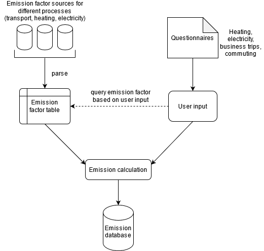

# How do we compute your carbon footprint?

We believe that good solutions come with the use of scientifically sound approaches and transparency. This is why we are sharing the information about how we calculate $CO_2$ emissions from the user inputs. For this, we need so-called emission factors, which allow us to convert units of activity (e.g., distance travelled in km) to greenhouse gas emissions in $CO_2$ equivalents. 

You can find the source code and data in our [GitHub repository](https://github.com/pledge4future/WePledge).

## 1 General information
### What are CO2 e-emissions?

Anthropogenic climate change is caused by greenhouse gases, such as carbon dioxide ($CO_2$), methane ($CH_4$), nitrous oxides ($N_2O$) and others. The molecules of these gases contribute differently to global warming. For example, the impact of one methane molecule is 21 times higher than the impact caused by one carbon dioxide molecule [6]. This is why the impact of different greenhouse gases is usually converted to the equivalent impact that carbon dioxide molecules would have. Therefore, for carbon footprint calculations, $CO_2$ equivalents are used as a standard unit [2].

### Calculation of your carbon footprint

 

The *co2calculator* can compute emissions caused by four big areas of the work life: electricity, heating, business trips and commuting. These were identified as the major emission sources by Jahnke et al. (2020) [3], who calculated the carbon footprint of their research institute. Emissions are given as $CO_2$ equivalents $E$ [kg]. 

Business trips and field trips are assessed on an individual level whereas heating and electricity are assessed once for the entire research group.

The emissions $E$ are calculated using emission factors $\epsilon$ from different sources:
- [Probas](https://www.probas.umweltbundesamt.de/php/index.php): electricity, heating, most cars, buses, trains
- [UBA (2021). "Umweltfreundlich mobil"](https://www.umweltbundesamt.de/en/publikationen/umweltfreundlich-mobil): bicycles, pedelecs, trams
- [GOV.UK (2020). Greenhouse gas reporting: conversion factors 2020](https://www.gov.uk/government/publications/greenhouse-gas-reporting-conversion-factors-2020): planes, ferries, electric cars, motorbikes

More information about the sources of the emission factors can be found in chapter 6 of this document.

The specific emission factors for different activities are collected in [this emission factor table](https://github.com/pledge4future/co2calculator/blob/dev/data/emission_factors.csv). 

The basic formula is $E = \epsilon \times C$, with $E$ being the $CO_2$ equivalents, $\epsilon$ being a specific emission factor and $C$ being consumption (e.g. of electricity).

## 2 Electricity

For electricity the user can select between the German electricity mix or solar power. The German electricity mix applies, if the research institute has a regular German electricity contract. Solar power is applicable, if the institute uses self-generated power from solar panels. The user is asked for the annual electricity consumption $C$ [kWh] which is then used to calculate the $CO_2$ equivalents $E$ [kg]. Since the emission factors $\epsilon$ for heating and electricity in the ProBas database apply for a consumption of 1 TJ, the consumption needs to be converted from kWh to TJ with a conversion factor of 277777.7778.

$$
E = \epsilon_{\text{electricity}} \times \frac{C}{277777.7778}
$$

$\underline{\text{Example:}}$ $3942.6 \text{ kg} = 109518 \text{ kg/TJ} \times \frac{10000 \text{ kWh}}{277777.7778}$

### Defining a share of electricity use

If the electricity consumption is only known for a building or building complex and the group occupies only parts of the building and uses only parts of the appliances, the total consumption and an estimate of the share of energy use (approximated from the share of the building area) can be provided.

## 3 Heating

The user is asked about the annual consumption $C$ and the energy sources for heating, based on which the $CO_2$ emissions $E$ are determined. Heating consumption can be provided in kWh, or in other units, depending on the fuel type (see this [conversion table](https://github.com/pledge4future/co2calculator/blob/dev/data/conversion_factors_heating.csv)):
- Oil: l
- Liquid gas, Coal, Pellets, Wsoodchips: kg
- Gas: $m^3$

The conversion factors $\kappa$ are retrieved from:
- [BAFA (2020): Merkblatt zur Ermittlung des Gesamtenergieverbrauchs](https://www.bafa.de/SharedDocs/Downloads/DE/Energie/ea_ermittlung_gesamtenergieverbrauch.html)
- [Krajnc, N. (2015): Wood fuels handbook, FAO](https://agris.fao.org/agris-search/search.do?recordID=XF2017001919)

The emission factors \epsilon_{\text{heating}} depend on the fuel type. Fuel types may be oil, gas, liquid gas, electricity, coal, district heating, different types of heat pumps (ground, air, water), pellets, woodchips and solar.

$$
C = \kappa \times C_{\text{other unit}}
\\
E = \epsilon_{\text{heating}} \times \frac{C}{277777.7778}
$$

$\underline{\text{Example:}}$ $2360.8 \text{ kg CO2e} = 65578 \text{ kg/TJ} \times \frac{10000 \text{ kWh}}{277777.7778}$

### Defining a share of heating consumption

If the heating consumption is only known for a building or building complex and the group occupies only parts of the building, the total consumption and an estimate of the share of energy use (approximated from the share of the building area) can be provided.

### Normalizing heating and cooling consumption based on weather conditions

Buildings in colder climates may require more heating in the winter than buildings in warmer environments. Similarly, buildings in cooler climates will require less cooling in summer months than buildings in hot climates. Degree Days are a measure of how warm or cold a location is, and therefore offer a way to compare the heating and cooling consumptions between different locations or years. 

There are many definitions one may use to quantify degree-days [ex. 9, 10, 14, 15]. In this work, we use the `integration approach’, which is considered to be the most rigorous approach in the literature [10, 15]. The definition is given below, where $D$ is the degree days between times $t_0$ and $T$, $t$ is time in days, $\theta$ is the outside temperature, and $\theta_{\text{ref}}$ is the reference temperature.

$$
\begin{aligned}
D_{\text{heating}} &= \int_{t_0}^{T} \max \left\lbrace 0 , \theta_{\text{ref}} - \theta (t) \right\rbrace d t
\\
D_{\text{cooling}} &= \int_{t_0}^{T} \max \left\lbrace 0 , \theta (t) - \theta_{\text{ref}} \right\rbrace d t
\end{aligned}
$$

The reference temperature is fixed for simplicity, and is chosen in our case to be consistent with the literature values (15.5°C for heating, and 22°C for cooling [9,10,11]). The $\max$ function is used to ensure that degree days are only calculated for times where the temperature is either below the heating reference temperature (indicating heating is required), or above the cooling reference temperature (indicating cooling is required). In practice, the inside temperature of a building will fluctuate (especially in intermittently heated buildings), and the thermostat settings may influence either the reference temperature or the degree days behaviour as the outside temperature approaches this reference temperature (ex. through a soft cutoff). However, we choose to simplify and standardize our definition of degree days, noting that most of these effects will be reflected in the building consumption anyway. Given a location and time period, this functions above are computed using hourly ERA5 reanalysis temperature data [16] and numerical integration.

We can then use the computed degree days to more fairly compare heating and cooling consumption between different years or locations. See the two examples below. 

#### Example 1: Comparing heating consumption over 3 months within a single working group

A working group called WG1 starts to use P4F in January 2020 with a heating consumption of 300 units. WG1 is interested in comparing their heating consumption in the following 2 months of February and March with their original consumption in January. In other words: If the weather conditions had been the same in February and March as they were in January, would they have saved energy due to their improved consumption behaviors?

Working group | Month/year | Heating/cooling consumption | Degree days | Scale factor | Rescaled heating consumption 
------------ | ------------- | ------------- | ------------ | ------------- | -------------
 WG1  |  01/2020 | 300  |  4 = REF |  4/4 = 1  | 300
 WG1  |  02/2020 | 250  |  5 |  4/5 = 0.8  | 250x0.8 = 200
 WG1  |  03/2020 | 100  |  2 |  4/2 = 2  | 100x2 = 200
 
In this example, WG1 can find out the following: 

1. Although the absolute heating consumption only decreased by 50 units from January 2020 to February 2020, since February was colder than January, this does not fully represent the improved heating consumption behaviours. In fact, had the temperature been the same in February as it was in January, WG1 would have decreased consumption by 100 units! Congratulations to the working group!
2. In March, WG1's absolute heating consumption was 200 units lower than in January, and 150 units lower than in February. However, taking into account that March was warmer than both January and February, we can see that WG1 indeed did not change their heating consumption behaviours from February to March at all. Their decreased consumption was only due to the warmer weather. So, WG1 still has more work to do!

#### Example 2: Comparing heating consumption between 2 different working groups

A working group called WG1 is located in a warm place (e.g. Italy), and another working group called WG2 in a cold place (e.g. Canada). WG2 is interested in comparing their heating consumption with WG1 over the months of January and February 2020. In other words: If the weather conditions had been the same in Canada as they were in Italy, would WG2 have been more energy efficient than WG1?

The reference value for the month of January 2020 is WG1's (Italy) calculated degree days for the same month, January 2020. The reference value for the month of February 2020 is WG1's calculated degree days for February 2020. 
 
 Working group | Month/year | Heating/cooling consumption | Degree days | Scale factor | Rescaled heating consumption
------------ | ------------- | ------------- | ------------ | ------------- | -------------
 WG1  |  01/2020 | 300  |  3 = REF01/2020 | 1  | 300
 WG1  |  02/2021 |  200 |  4 = REF02/2021 |  1 | 200
 WG2  |  01/2020 | 400  |  5 |  3/5=0.6  | 400x0.6 = 240
 WG2  |  02/2021 | 300  |  5 |  4/5=0.8  | 300x0.8 = 240
 
In this example, WG2 can find out the following:

1. In January 2020, although WG2’s absolute heating consumption was 100 units higher than WG1’s consumption, since it was colder in Canada, this does not fully represent WG2’s energy efficient habits. In fact, had the temperature been the same in Canada as it was in Italy, WG2 we would have consumed 60 units less than WG1! Congratulations to WG2!
2. In February 2020, both working groups decreased their absolute heating consumption by 100 units. However, February was a particularly cold month in Italy, and WG1 actually improved their heating consumption behaviours much more than WG2 did in Canada. If the temperature been the same in Canada as it was in Italy for February, WG2 would have consumed 40 units more than WG1! WG2 should improve their consumption behaviours to catch up to WG1!

#### What if degree days are zero?
Although this is a fringe case, the possibility of having a value of zero for degree days, and therefore dividing by zero when rescaling consumptions, presents an issue. We avoid this issue by manually setting a minimum value for degree days of 0.1. Note that this modified minimum value represents a very small deviation from the actual temperature series, and therefore does not largely affect what the degree days value represents.

## 4 Business trips

The `co2calculator` allows to quantify the $CO_2e$  emissions $E$ [kg] for individual business trips for different modes of transport. The $CO_2$  equivalent is a function of the distance $D$ travelled in km. This distance may either be directly provided, or it may be computed from given start and stop locations using [distances.py](https://github.com/pledge4future/co2calculator/blob/dev/co2calculator/distances.py). In the latter case, the coordinates of the locations have to be retrieved by geocoding and then the travel distance between the locations is computed. Next to the distance or the locations, the user defines the mode of transport and its specifica.

### Geocoding

Geocoding is done using the [openrouteservice](https://openrouteservice.org/dev/#/api-docs) geocoding service, which is built on top of [Pelias](https://github.com/pelias/pelias), a modular, open-source search engine for the world.

To find airports ([geocoding_airport](https://github.com/pledge4future/co2calculator/blob/5ac4e624f742f404299276e013f0f0194e5ba6da/co2calculator/distances.py#L45)), we use [Pelias search](https://github.com/pelias/documentation/blob/master/search.md) with the search text "**IATA-code** + Airport". For this, the user is asked to provide the IATA-codes of the start and end airport. To find train stations inside the EU ([geocoding_train_stations](https://github.com/pledge4future/co2calculator/blob/5ac4e624f742f404299276e013f0f0194e5ba6da/co2calculator/distances.py#L156)), we use the train station database of [Trainline EU](https://github.com/trainline-eu/stations). For this, the user is asked to provide the country and the name of the start and the end train station. For train trips outside of the EU and other modes of transport, we use [structured geocoding](https://github.com/pelias/documentation/blob/master/structured-geocoding.md) ([geocoding_structured](https://github.com/pledge4future/co2calculator/blob/5ac4e624f742f404299276e013f0f0194e5ba6da/co2calculator/distances.py#L98)). The structured geocoding parameters are:
- country: highest-level administrative division supported in a search. Full country name or two-/three-letter abbreviations supported
    - e.g., Germany / "DE" / "DEU"
- locality: equivalent to what are commonly referred to as cities (also municipalities)
    - e.g., Bangkok, Caracas
- address: street name, optionally also house number

### Distance computation

For cars and motorbikes, distances are computed with [openrouteservice](https://openrouteservice.org/dev/#/api-docs/directions) with the `profile='driving-car'`.

For other modes of transport (airplane, ferry, train, bus), the distances between the locations as the crow flies are computed with the [haversine formula](https://github.com/pledge4future/co2calculator/blob/ffc12ec577cb18bf7c67b628ff7d9d79ffeef25b/co2calculator/distances.py#L20). Then, different detour coefficients or constants are applied.
With the `roundtrip` option, users can define if their trip is a roundtrip in which case the distance will be doubled. 

#### Detour

Trips on earth will always make a detour, because it is usually not possible to travel in a straight line from start to destination. Therefore, we use coefficients and constants to account for this detour. These differ depending on the mode of travel. 

Mode of transport | Detour formula | Source 
------------ | ------------- | -------------
Bus | x 1.5 | Adapted from [GES 1point5](https://labos1point5.org/ges-1point5), who were advised by Frédéric Héran (economist and urban planner).
Train | x 1.2 | Adapted from [GES 1point5](https://labos1point5.org/ges-1point5), who were advised by Frédéric Héran (economist and urban planner).
Plane | + 95 km | CSN EN 16258 - Methodology for calculation and declaration of energy consumption and GHG emissions of transport services (freight and passengers), European Committee for Standardization, Brussels, November 2012, [Méthode pour la réalisation des bilans d’émissions de gaz à effet de , Version 4](https://www.ecologie.gouv.fr/sites/default/files/Guide%20m%C3%A9thodologique%20sp%C3%A9cifique%20pour%20les%20collectivit%C3%A9s%20pour%20la%20r%C3%A9alisation%20du%20bilan%20d%E2%80%99%C3%A9missions%20de%20GES.pdf), p. 53

### Specifica of the modes of transport for business trips

Business trips include five transportation types: car, train, bus, airplane, and ferry. Generally, the $CO_2e$  emissions $E$ in kg per passenger are calculated by multiplying the distance $D$ with a specific emission factor $\epsilon$. For all transportation modes except for car, the given emission factors are already in passenger kilometers. For cars, the emission factors we are using are in vehicle kilometers, so we multiply the distance by the emission factor and divide it by the number of passengers.  

$E_{\text{car}} = \epsilon_{\text{car}} \times \frac{D}{n}$

$E_{\text{bus/train/plane/ferry}} = \epsilon_{\text{bus/train/plane/ferry}} \times D$

$\underline{\text{Example (long-distance train):}}$ $16 \text{ kg CO2e} = 0.032 \text{ kg/P.km} \times 500 \text{ km}$

The emission factors $\epsilon$ are specified according to the transportation modes and their specifica, which are shown in the table below. We ask the user to give the values for the following specifica. If no value is given, the values marked in **bold** are used as default values.

Mode of transport | Fuel type | Size | Occupancy | Seating | Passengers | Range 
------------ | ------------- | ------------- | ------------ | ------------- | ------------- | -------------
Car | diesel, gasoline, cng, electric, hybrid, plug-in_hybrid, **average** | small, medium, large, **average** | - | - | **1**, 2, 3, 4, 5, 6, 7, 8, 9 | -
Train | diesel, electric, **average** | - | - | - | - | (assumes "long-distance")
Bus | diesel | medium, large, **average** | in % 20, **50**, 80, 100 | - | - | (assumes "long-distance")
Plane | - | - | - | **average**, Economy class, Business class, Premium economy class, First class | - | (determined from distance)
Ferry | - | - | - | **average**, Foot passenger, Car passenger | - | -

### Range categories

Trips are categorized based on their ranges, which can be used later for analysis and visualization purposes. 

- Very short haul: < 500 km
- Short distance: 500 - 1500 km
- Medium distance: 1500 - 4000 km
- Long distance: > 4000 km

## 5 Commuting

$CO_2e$  emissions $E$ [kg] from commuting are also quantified individually for each mode of transport [calc_co2_commuting](https://github.com/pledge4future/co2calculator/blob/2e102a0971dda57423fe7aef9958d0e61358248c/co2calculator/calculate.py#L445). For a given mode of transport, the user provides the average weekly distance $D_{\text{weekly}}$ travelled in a given time period (`work_weeks`). Available transportation modes are:
- Car
- (Local) bus
- (Local) train
- Tram
- Motorbike
- Bicycle
- Pedelec

### Specifica of the modes of transport for commuting

Emissions from commuting are calculated the same way as emissions from business trips by multiplying the weekly distance $D_{\text{weekly}}$ by an emission factor $\epsilon$:

$$
E_{\text{car}} = \epsilon_{\text{car}} \times \frac{D_{\text{weekly}}}{n}
$$

$$
E_{\text{bus/train/plane/ferry}} = \epsilon_{\text{bus/train/plane/ferry}} \times D_{\text{weekly}}
$$

$\underline{\text{Example (bus):}}$ $1.95 \text{kg CO2e} = 0.0389 \text{kg/P.km} \times 50 \text{km}$

The emission factors $\epsilon$ are specified according to the transportation modes and their specifica, which are shown in the table below. We ask the user to give the values for the following specifica. If no value is given, the values marked in **bold** are used as default values.

Mode of transport | Fuel type | Size | Occupancy | Seating | Passengers | Range 
------------ | ------------- | ------------- | ------------ | ------------- | ------------- | -------------
Car | diesel, gasoline, cng, electric, hybrid, plug-in_hybrid, **average** | small, medium, large, **average** | - | - | **1**, 2, 3, 4, 5, 6, 7, 8, 9 | -
Motorbike | - | small, medium, large, **average** | - | - | - | -
Train | diesel, electric, **average** | - | - | - | - | (assumes "local")
Bus | diesel | medium, large, **average** | in % 20, **50**, 80, 100 | - | - | (assumes "local")
Tram | - | - | - | - | - | -
Bicycle | - | - | - | - | - | -
Pedelec | - | - | - | - | - | -

### Aggregating to the group's level

If we assume that a representative sample of $n$ persons of the entire group, consisting of $N$ members,  entered their commuting data, we can obtain an estimate of the commuting emissions for the entire group:

$$
E_{\text{group}} = \frac{E_{\text{aggr}}}{n} \times N
$$

with $E_{\text{aggr}}$ being the sum of the $CO_2e$  emissions of all participants.

## 6 Emission factor sources

### ProBas database

The web portal [ProBas](https://www.probas.umweltbundesamt.de/php/index.php) provides process-oriented basic data from different projects. Most emission factors we use for commuting and business trips originate from [TREMOD](https://www.ifeu.de/en/project/uba-tremod-2019/), the Transport emission model [5]. ProBas uses data from the 2010 project, i.e., Version 5 [4]. Emission factors for specific car fuel types, and for heating and electricity come from [GEMIS](http://iinas.org/about-gemis.html) (Globales Emissions-Modell Integrierter
Systeme), a freely available computer model with an integrated database for lifecycle assessments and CO2 footprints of energy, resource and transport systems [7]. It was developed by the [Öko-Institut](https://www.oeko.de/en/) and then passed to the 
[International Institute for Sustainability Analysis and Strategy](http://iinas.org/news.html) (Internationales Institut für Nachhaltigkeitsanalysen und -strategien - IINAS) in 2012.

### Brochure "Umweltfeundlich mobil!"

The brochure ["Umweltfreundlich mobil!"](https://www.umweltbundesamt.de/en/publikationen/umweltfreundlich-mobil) by the Umweltbundesamt (Federal Environmental Agency) of Germany assesses the environmental impact of different modes of transport [8]. The emission factors for bicycles, pedelecs, and tram were taken from Table 3 on p. 38 of this brochure.

### Greenhouse gas reporting: conversion factors 2020

This comprehensive set of [conversion factors](https://www.gov.uk/government/publications/greenhouse-gas-reporting-conversion-factors-2020) provided by the UK Department for Business, Energy & Industrial Strategy is intended for use by companies and other organizations to report on their greenhouse gas emissions. We have used conversion factors for planes, ferries, electric cars, and motorbikes from this source.

## 7 Calculation of remaining carbon budget

In the plots of your emissions dashboard, your remaining carbon budget is visible as a green line. This is meant as a coarse figure that you can compare your emissions to. “The term ‘carbon budget’ refers to the maximum amount of cumulative net global anthropogenic CO2 emissions that would result in limiting global warming to a given level with a given probability, taking into account the effect of other anthropogenic climate forcers. This is referred to as the total carbon budget when expressed starting from the pre-industrial period, and as the remaining carbon budget when expressed from a recent specified date (Glossary). The remaining carbon budget indicates how much CO2 could still be emitted while keeping warming below a specific temperature level" ([IPCC 2021, p. 28](https://www.ipcc.ch/report/ar6/wg1/downloads/report/IPCC_AR6_WGI_SPM.pdf)).

To calculate the remaining carbon budget, we followed an equal-per-capita approach. This means that the remaining global carbon budget is distributed equally among the world's population. First, we divide the amount of CO2 that can still be emitted worldwide by the world' population. For example, to reach the 1.5° goal, we can still emit 300 billion tons of CO2. We need to take into account that the population of the world is growing, so we do not divide the amount of CO2 by the current population of the world, but instead we divide it by the mean between the current population and the population projected for 2050. 2050 is when most of the countries plan to be carbon neutral. Finally, we divide the remaining carbon budget per person by the number of years left until carbon neutrality should be reached. The calculation of the carbon budget is summed up in the following table. Since Germany has pledged to be carbon neutral already by 2045, the remaining time is shorter and therefore the remaining carbon budget per person and year is a bit higher.

You can view this remaining carbon budget per person and year as the average amount of carbon that you can still emit per year until 2050 (or 2045). Probably, your emissions will decrease gradually until you become carbon-neutral. So it is ok if you are still emitting more than your yearly budget at the moment, as long as your annual emissions will sink below your annual budget soon enough.

Goal (°C) | Total carbon budget [t] | Carbon budget per person (2020-2050) [t] | Carbon budget per person and year in Germany (2020-2045) [t] | Carbon budget per person and year (2020-2050) [t]
------------ | ------------- | ------------- | ------------ | -------------
1.5 | 3 billion | 34.0 | 1.4 | 1.1
2 | 9 billion | 101.9 | 4.1 | 3.4

## 8 References

- [1] Department for Business, Energy & Industrial Strategy, (2020). Greenhouse gas reporting: conversion factors 2020. https://www.gov.uk/government/publications/greenhouse-gas-reporting-conversion-factors-2020

- [2] Gohar, L. K. & Shine, K. P., (2007). Equivalent CO2 and its use in understanding the climate effects
of increased greenhouse gas concentrations. Weather, 62: 307-311.
https://doi.org/10.1002/wea.103

- [3] Jahnke, K., Fendt, C., Fouesneau, M. et al. An astronomical institute’s perspective on meeting the challenges of the climate crisis. Nat Astron 4, 812–815 (2020). https://doi.org/10.1038/s41550-020-1202-4

- [4] IFEU Heidelberg, Umweltbundesamt (UBA), 2010. TREMOD (Transport emission model) version
5.1. Data and calculation model; energy use and pollutant emissions of motorized traffic in
germany on behalf of Umweltbundesamt (UBA).
https://www.bmu.de/fileadmin/Daten_BMU/Pools/Forschungsdatenbank/fkz_3707_45_101_motorisierter_verkehr_bf.pdf

- [5] IFEU Heidelberg, Umweltbundesamt (UBA), 2019. TREMOD (Transport emission model).
https://www.ifeu.de/en/project/uba-tremod-2019/

- [6] Moss, A. R., Jouany, J. P., & Newbold, J., (2000). Methane production by ruminants: its
contribution to global warming. In Annales de zootechnie (Vol. 49, No. 3, pp. 231-253). EDP
Sciences. https://doi.org/10.1051/animres:2000119

- [7] Öko-Institut, International Institute for Sustainability Analysis and Strategy (IINAS), 2021. GEMIS
(Globales Emissions-Modell Integrierter Systeme): freely available computer model with
integrated database for lifecycle asessments and co2 footprints of energy, resource and
transport systems, developed by Öko-Institut, 2012 passed to the International Institute for
Sustainability Analysis and Strategy/Internationales Institut für Nachhaltigkeitsanalysen und
-strategien (IINAS). http://iinas.org/about-gemis.html

- [8] Umweltbundesamt (UBA), 2021. Umweltfreundlich mobil! Ein ökologischer Verkehrsartenvergleich für den Personen- und Güterverkehr in Deutschland. https://www.umweltbundesamt.de/en/publikationen/umweltfreundlich-mobil

- [9] Day AR, Karayiannis TG. Degree-days: Comparison of calculation methods. Building Services Engineering Research and Technology. 1998;19(1):7-13. doi:10.1177/014362449801900102

- [10] Spinoni, J., Vogt, J. V., Barbosa, P., Dosio, A., McCormick, N., Bigano, A., & Füssel, H. (2018). Changes of heating and cooling degree‐days in Europe from 1981 to 2100, 38, e191–e208. doi:10.1002/joc.5362

- [11] Spinoni, J., Vogt, J. and Barbosa, P. (2015), European degree-day climatologies and trends for the period 1951–2011. Int. J. Climatol., 35: 25-36. https://doi.org/10.1002/joc.3959

- [12] Matzarakis, A. and Balafoutis, C. (2004), Heating degree-days over Greece as an index of energy consumption. Int. J. Climatol., 24: 1817-1828. https://doi.org/10.1002/joc.1107

- [13] Météo-France, « Degres jours unifies - DJU », Relevés et statistiques, 2017 (consulted on 19/01/2023).

- [14] Comité scientifique et technique des industries climatiques, « https://www.costic.com/ressources-techniques-et-reglementaires/service-degres-jours-unifies », consulted on (19/01/2022).
 
- [15] Degree-Days: About degree-days. University of California Agriculture & Natural Resources: Statewide Integrated Pest Management Program. Retrieved January 19, 2023, from https://ipm.ucanr.edu/WEATHER/ddconcepts.html 

- [16] Muñoz Sabater, J., (2019): ERA5-Land hourly data from 1981 to present. Copernicus Climate Change Service (C3S) Climate Data Store (CDS). 10.24381/cds.e2161bac
